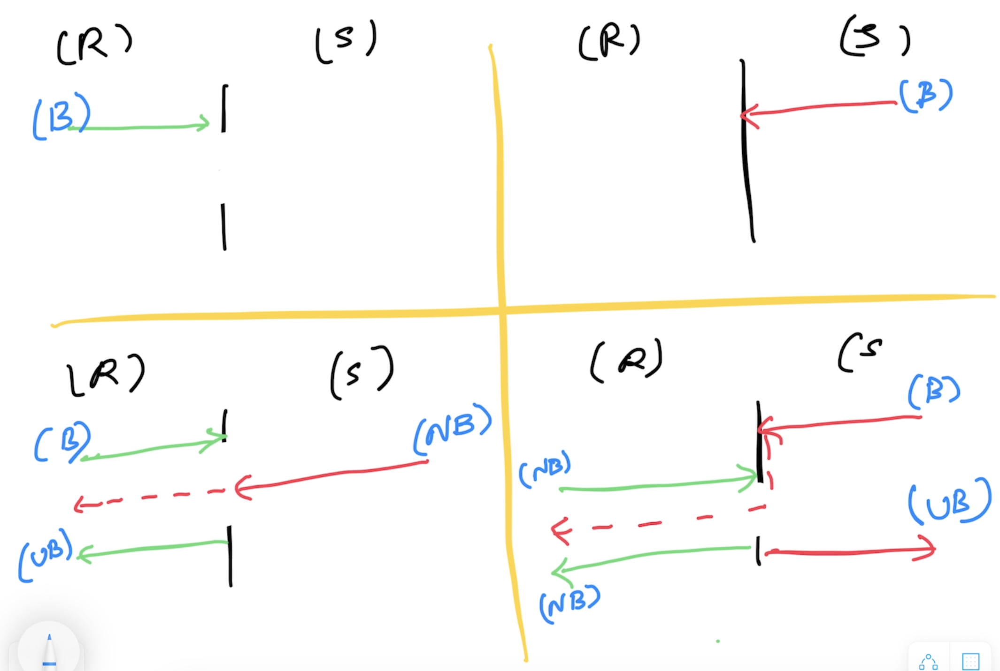

# Advanced Go

## Recap

### Functions

## Modules & Packages

### Module
- Code that need to be versioned and deployed together
- A folder with a "go.mod" file
- go.mod file
    - manifest file containing meta data information
        - module name
        - go runtime version targetted
        - dependencies
### Commands
- To create a module file
    > go mod init [module_name]
- To create a build of a module
    > go build .
- To execute a module
    > go run .
- To include a 3rd party dependency
    > go get [module_name]
- To upgrade a 3rd party dependency
    > go get -u [module_name]
- To update the go.mod file 
    > go mod tidy
- To download the dependencies (documented in the go.mod file)
    > go mod download
- To get the dependency graph
    > go mod graph
- To get the dependency graph of one module
    > go mod why [module_name]
- To install a 3rd party module as an executable (CLI tools) (installed in the $GOPATH/bin folder)
    > go install [module_name]
- To localize the dependencies
    > go mod vendor

- Reference:
    - https://go.dev/ref/mod
### Package
- Internal organization of the code in a module

### TODO
- Analyze binaries for package inclusion/exclusion in build

## Concurrency
### Channel (data type for enabling communication between goroutines)
- Declaration
- > var [var_name] chan [data_type]
- > ex: var ch chan int
- Initialization
- > [var_name] = make(chan [data_type])
- > ex: ch = make(chan int)
- Operations (using channel operation [ <- ])
    - Send Operation
        - > [chan_var] <- [data]
        - > ex: ch <- 100
    - Receive Operation
        - > <- [chan_var]
        - > ex: data := <- ch
### Channel Behavior

## Context
- Primarily for cancel propagation
- Can create a hierarchy of contexts
- Cancellation strategy
    - Can be programmatic
    - Can be time based
- Can also use context to share data across hierarchy of goroutines
- APIs
    - context.Background() 
        - used to create the root context
    - context.WithValue() 
        - used to create context for sharing data (no cancellation)
    - context.WithCancel()
        - programmatic cancellation
    - context.WithTimeout()
        - timer based cancellation (relative time)
    - context.WithDeadline()
        - timer based cancellation (absolute time)